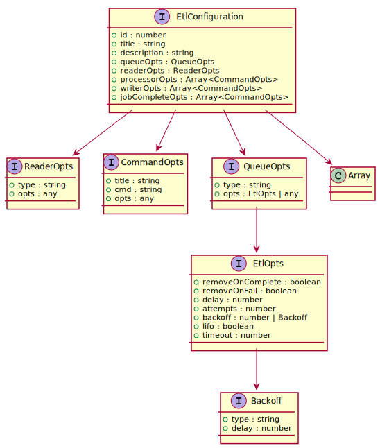
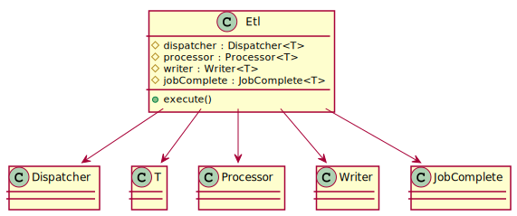

# Data Pipeline Design Patterns

Consist of the following core components:

- Reader
- Command
- Queue
- Worker
- Etl

## Reader

Reader is used by Dispatcher worker to get Raw data into the queue.

Reader interface has a single Read method that will return a Readstream.

``` typescript
export interface Reader {
  read(): ReadStream;
}
```

Concrete classes include: `FileReader`, `RdbmsReader`, `EsReader`


## Command

Command is used by Processor & Writer to perform data transformation & data loading to another destination.

Command interface has a single `execute` method that will take a generic type instace and return the back type instace

``` typescript
export interface Command<T> {
  execute(data: T): T;
}
```

Concrete classes include: `Geocode`, `StandardizeCompanyName`, `HalalCompanyLookup`, `StandardizeAddressCity`


## Queue

Queue is responsible to publish jobs to workers that subscribed to the queues

Queue interface has `add`, `empty` and `on` methods.


Concrete classes include: `BullQueue` & `RabbitMqQueue`. Since BullQueue has advanced functionality, it also implements QueuePausable & QueueIndexable interface, while RabbitMqQueue does not.


## Workers


There are 4 type of workers, all have execute methods and publish/subs to different queue, as follows:

### Dispatcher

Read data from a data source and publish it into Raw Queue.

Dispatcher receive a ReaderOpts.

``` typescript
export interface ReaderOpts {
  type: string;
  opts: any;
}
```

### Processor, Writer & Job Complete

- Processor: Subscribe to Raw Queue and perform data transformation & publish it to Output Queue
- Writer: Subscribe to Output Queue and load it to various data sources
- JobComplete: Subscribe to Job Complete Queue and perform custom business logics. Example hooks such as Generate Control Figure & Data Quality reports & Sending email notifications

Processor, Writer & Job Complete all receive a list of CommandOpts

``` typescript
export interface CommandOpts {
  title: string;
  cmd: string;
  opts: any;
}
```

Worker Snippets:

``` typescript
import { Queue } from './queue';
import {
  ReaderOpts,
  ReaderFactory,
  CommandOpts,
  CommandsFactory,
  HooksFactory,
} from './factory';

export class Dispatcher<T> {
  protected readerOpts: ReaderOpts;
  protected inputQueue: Queue<T>;
  protected rawQueue: Queue<T>;

  constructor(
    readerOpts: ReaderOpts,
    inputQueue: Queue<T>,
    rawQueue: Queue<T>
  ) {
    this.readerOpts = readerOpts;
    this.inputQueue = inputQueue;
    this.rawQueue = rawQueue;
  }

  execute(): void {
    this.inputQueue.on('data', readerOpts => {
      const reader = ReaderFactory.createReader(readerOpts);
      const readStream = reader.read();
      readStream.on('data', data => {
        this.rawQueue.add(data);
      });
    });
  }
}

export class Processor<T> {
  protected inputQueue: Queue<T>;
  protected outputQueue: Queue<T>;
  protected commandsOptions: Array<CommandOpts>;

  constructor(
    commandsOptions: Array<CommandOpts>,
    inputQueue: Queue<T>,
    outputQueue: Queue<T>
  ) {
    this.commandsOptions = commandsOptions;
    this.inputQueue = inputQueue;
    this.outputQueue = outputQueue;
  }

  execute(): void {
    const commands = CommandsFactory.createCommands(this.commandsOptions);
    this.inputQueue.on('data', data => {
      let output = data;
      commands.forEach(command => {
        const result = command.execute(data);
        output = {
          ...output,
          ...result,
        };
      });
      this.outputQueue.add(output);
    });
  }
}

export class Writer<T> {
  protected outputQueue: Queue<T>;
  protected commandsOptions: Array<CommandOpts>;

  constructor(commandsOptions: Array<CommandOpts>, outputQueue: Queue<T>) {
    this.commandsOptions = commandsOptions;
    this.outputQueue = outputQueue;
  }

  execute(): void {
    const commands = CommandsFactory.createCommands(this.commandsOptions);
    this.outputQueue.on('data', (data: T) => {
      let output = data;
      commands.forEach(async command => {
        const result = await command.execute(data);
        output = {
          ...data,
          ...result,
        };
      });
      this.outputQueue.add(output);
    });
  }
}

export class JobComplete<T> {
  protected jobCompleteQueue: Queue<T>;
  protected hooksOpts: Array<CommandOpts>;

  constructor(hooksOpts: Array<CommandOpts>, jobCompleteQueue: Queue<T>) {
    this.hooksOpts = hooksOpts;
    this.jobCompleteQueue = jobCompleteQueue;
  }

  execute(): void {
    this.jobCompleteQueue.on('data', data => {
      const hooks = HooksFactory.createHooks(this.hooksOpts);
      hooks.forEach(hook => {
        hook.execute(data);
      });
    });
  }
}

```

## ETL

### Configuration

A big config object that consists of the following options:



- Title & Description: The title of the etl job & its desc
- QueueOpts: message broker technology to be used (eg: `Bull` or `RabbitMQ`) & its options
- ReaderOpts: the data source (eg: `mySQL`, `file` etc) & its options
- Commands:
  - Processor: Data transformation or enrichment to be executed
  - Writer: Where to load the output data
  - Job Complete: Custom logics or hooks to be run once job is completed

### Factory

Factory are responsible to create the correct concrete class based on the ETL configurations:

- ReaderFactory
- CommandsFactory
- HooksFactory
- QueueFactory

### The class

ETL class tie all the interfaces together and spawn the correct worker type based on the environment variables.



``` typescript
import { EtlConfiguration, QueueFactory } from './factory';
import { Dispatcher, Processor, Writer, JobComplete } from './worker';

export class Etl<T> {
  protected dispatcher: Dispatcher<T>;
  protected processor: Processor<T>;
  protected writer: Writer<T>;
  protected jobComplete: JobComplete<T>;

  constructor(etlConfig: EtlConfiguration) {
    const inputQueue = QueueFactory.createQueue('input', etlConfig.queueOpts);
    const rawQueue = QueueFactory.createQueue('raw', etlConfig.queueOpts);
    const outputQueue = QueueFactory.createQueue('output', etlConfig.queueOpts);
    const jobCompleteQueue = QueueFactory.createQueue(
      'complete',
      etlConfig.queueOpts
    );

    this.dispatcher = new Dispatcher(
      etlConfig.readerOpts,
      inputQueue,
      rawQueue
    );
    this.processor = new Processor(
      etlConfig.processorOpts,
      inputQueue,
      outputQueue
    );
    this.writer = new Writer(etlConfig.writerOpts, outputQueue);
    this.jobComplete = new JobComplete(
      etlConfig.jobCompleteOpts,
      jobCompleteQueue
    );
  }

  execute() {
    if (process.env.TYPE === 'dispatcher') this.dispatcher.execute();
    if (process.env.TYPE === 'processor') this.processor.execute();
    if (process.env.TYPE === 'writer') this.writer.execute();
    if (process.env.TYPE === 'jobComplete') this.jobComplete.execute();
  }
}
```

## Use Cases

### StatsBDA Automation


Example job configuration:

``` typescript
const msbrJob: JobConfiguration = {
  id: 1,
  title: 'msbr job',
  description: 'harmonize, SSM lookup & geocode msbr records',
  input: {
    dbType: 'postgres',
    host: 'localhost',
    database: 'statsbda',
    username: 'postgres',
    password: 'tmgds20s',
    port: 4567,
    table: 'tec_msbr_<mothYear:mmyyyy>'
  },
  processing: [
    {
      title: 'Remove Invalid Characters',
      cmd: 'remove/invalid',
      opts: {
        src: 'buss_name',
        dest: 'buss_name_cln'
      }
    },
    {
      title: 'Standardize Company Names',
      cmd: 'company/std',
      opts: {
        src: 'buss_name',
        dest: 'buss_name_std'
      }
    },
    {
      title: 'Remove Company Generics',
      cmd: 'company/generic',
      opts: {
        src: 'buss_name',
        dest: 'buss_name_nogeneric'
      }
    },
    {
      title: 'Halal Lookup',
      cmd: 'lookup',
      opts: {
        type: 'match', // other options: 'term', 'matchPhrase'
        operation: 'OR', // or 'AND'
        index: 'lookup_halal_company',
        queries: [
          {
            src: 'company_name',
            dest: 'name'
          },
          {
            src: 'business_reg_no',
            dest: 'brn'
          }
        ],
        result: 'result.length > 0'
      }
    }
  ],
  output: [
    {
      title: 'Write back to the same DB',
      cmd: 'DBWriter',
      opts: {
        index: 'tec_msbr_<month:MMyyyy>',
        createTable: true,
        autoDrop: true,
        truncate: true,
        dbType: 'postgres',
        host: 'localhost',
        database: 'statsbda',
        username: 'postgres',
        password: 'tmgds20s',
        port: 4567
      }
    },
    {
      title: 'Index into the search engine',
      cmd: 'ESWriter',
      opts: {
        index: 'tec_msbr_<month:MMyyyy>',
        deleteIndex: true,
        createMapper: true,
        host: 'localhost',
        username: 'postgres',
        password: 'tmgds20s'
      }
    }
  ],
  jobComplete: [
    {
      title: 'Two Way Traders',
      cmd: 'aggregate',
      opts: {
        fields: ['trade_type'],
        index: 'tec_msbr_<monthYear: MMyyyy>',
        result: 'result.length === 1'
      }
    },
    {
      title: 'Agent Flag',
      cmd: 'lookup',
      opts: {
        type: 'match',
        operation: 'OR',
        index: 'lookup_agent',
        queries: [
          {
            src: 'company_name',
            dest: 'name'
          },
          {
            src: 'business_reg_no',
            dest: 'brn'
          }
        ],
        result: 'result.length > 1'
      }
    },
    {
      title: 'Generate Data Quality Reports',
      cmd: 'DataQualityGenerator',
      opts: {
        jobId: 'this.id'
      }
    },
    {
      title: 'Generate Control Figure Reports',
      cmd: 'ControlFigureGenerator',
      opts: {
        jobId: 'this.id'
      }
    },
    {
      title: 'Send Email',
      cmd: 'EmailSender',
      opts: {
        subject: 'MSBR Job Completed at <now:dd/MM/yyyy:mm:ss>',
        body: ''
      }
    }
  ]
};
```
